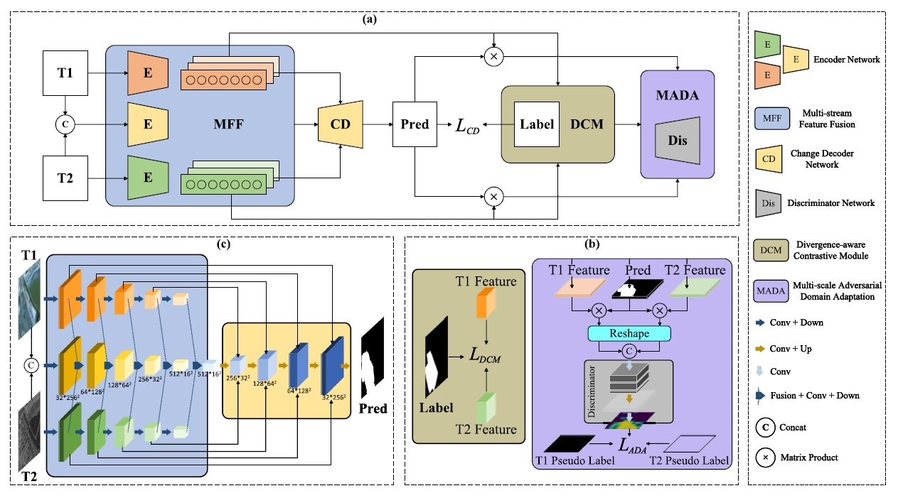

# AFENet

<p align="center">
  
</p>

This is a PyTorch/GPU implementation of the paper [Adversarial Feature Equilibrium Network for Multimodal Change Detection in Heterogeneous Remote Sensing Images](https://ieeexplore.ieee.org/document/10716673):

```
@ARTICLE{pu2024adversarial,
  author={Pu, Yan and Gong, Maoguo and Liu, Tongfei and Zhang, Mingyang and Gao, Tianqi and Jiang, Fenlong and Hu, Xiaobo},
  journal={IEEE Transactions on Geoscience and Remote Sensing}, 
  title={Adversarial Feature Equilibrium Network for Multimodal Change Detection in Heterogeneous Remote Sensing Images}, 
  year={2024},
  volume={62},
  number={},
  pages={1-17},
```

## Preparation

### Dataset

### Installation

For convenience, our pre-trained models can be downloaded directly here as well:

| Model                                                                                                    | Dataset      | F1-Score    | Params      | 
|----------------------------------------------------------------------------------------------------------|--------------|-------------|-------------|
| [G_model](https://drive.google.com/file/d/1Q4-YJUEQAMgqy3FfQak-3VPsHSe5N1_f/view?usp=drive_link)         | MT-Wuhan     | 60.03       | 297.8M      |
| [D_model](https://drive.google.com/file/d/1eMEVYUmj_0mQdr07SBqrPzBXC-vdEjd5/view?usp=drive_link)         | MT-Wuhan     | 60.03       | 11.7M       |


## Preparation


## Usage

### Training
